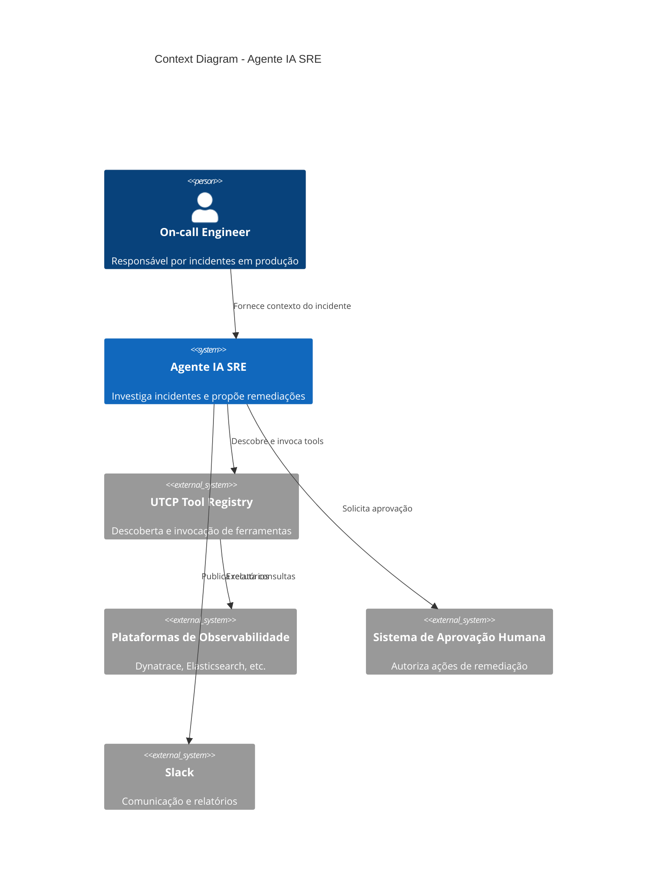
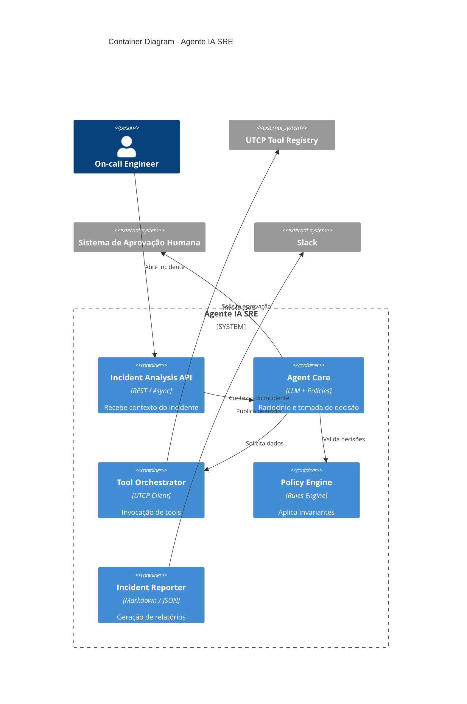

# Agente IA SRE — Arquitetura de Resposta a Incidentes com LLMs


## 📌 Visão Geral

Este repositório documenta a **arquitetura de um Agente de IA para SRE (Site Reliability Engineering)**, projetado para **investigar incidentes em produção**, correlacionar dados de observabilidade e **propor ações de remediação**, respeitando regras de segurança, SLA e aprovação humana.

O foco deste projeto **não é implementação**, mas sim **arquitetura, domínio e decisões técnicas**, aplicando boas práticas de:

- Arquitetura de Software
- Domain-Driven Design (DDD)
- C4 Model
- Architecture Decision Records (ADR)
- Observabilidade e SRE
- Uso responsável de LLMs em ambientes críticos

---

## 🎯 Objetivo do Projeto

Demonstrar como um **agente baseado em LLM** pode ser usado de forma **segura e governada** para:

- Apoiar engenheiros de plantão (on-call)
- Reduzir MTTR (Mean Time to Resolution)
- Automatizar investigação de incidentes
- Evitar alucinações por meio de dados reais
- Manter controle humano sobre decisões críticas

---

## 🧠 Escopo e Delimitação de Domínio

### Bounded Context: **Agente IA SRE**

Este projeto define **explicitamente** um único domínio central:

> **Agente IA SRE** — responsável por investigação, correlação e decisão.

### Dentro do escopo
- Raciocínio do agente
- Formulação de hipóteses
- Estratégia de investigação
- Correlação de métricas, eventos e logs
- Proposta de ações de remediação
- Aplicação de regras de negócio e políticas

### Fora do escopo (tratados como sistemas externos)
- Dynatrace, Elasticsearch, Kubernetes
- Slack ou outros canais de comunicação
- Execução direta de ações em produção
- Workflow completo de incidentes

Essa separação garante **clareza arquitetural e baixo acoplamento**.

---

## 🧩 Arquitetura — C4 Model
> Nota: O diagrama segue o C4 Model conceitualmente, usando Mermaid padrão
> para garantir compatibilidade com o GitHub.

### C4 — Level 1: Context Diagram

Mostra como o **Agente IA SRE** se relaciona com pessoas e sistemas externos.



### C4 — Level 2: Container Diagram

Detalha a organização interna do Agente.



### C4 — Level 3: Component Diagram (Agent Core)

Mostra onde está o valor de negócio principal.

```mermaid
    C4Component
    title Component Diagram - Agent Core

    Container(agent, "Agent Core") {
        Component(hypothesis, "Hypothesis Builder", "LLM Prompting", "Formula hipóteses")
        Component(strategy, "Investigation Strategy", "Decision Logic", "Define estratégia de investigação")
        Component(correlation, "Correlation Engine", "Business Logic", "Correlaciona dados")
        Component(decision, "Remediation Decision Engine", "Policy-aware", "Propõe ações")
    }

    Container(policy, "Policy Engine")
    Container(orchestrator, "Tool Orchestrator")

    Rel(hypothesis, strategy, "Gera hipóteses")
    Rel(strategy, orchestrator, "Solicita dados")
    Rel(correlation, decision, "Fornece evidências")
    Rel(decision, policy, "Valida ações")
```

## 📄 Architecture Decision Records (ADR)
### ADR-001 — Definição do Bounded Context “Agente IA SRE”

Status: Accepted
Decisão:
Definir o Agente IA SRE como um bounded context independente, responsável apenas por investigação, correlação e decisão.

Consequências:
- Clareza de domínio
- Menor acoplamento
- Evolução independente

### ADR-002 — Uso de UTCP para Acesso a Ferramentas

Status: Accepted
Decisão:
Todas as integrações com sistemas externos ocorrem via UTCP Tools, evitando dependências diretas.
Consequências:

- Padronização
- Segurança
- Reuso por múltiplos agentes

### ADR-003 — Human-in-the-Loop para Remediações

Status: Accepted
Decisão:
Nenhuma ação destrutiva pode ser executada sem aprovação humana explícita.
Consequências:

- Redução de risco
- Compliance
- O agente atua como advisor

### ADR-004 — SLA de Investigação como Regra de Domínio

Status: Accepted
Decisão:
O agente deve gerar um diagnóstico preliminar dentro de um SLA configurável.
Consequências:

- Limite de tempo para investigação
- Controle de chamadas externas
- Melhor suporte ao on-call

### ADR-005 — Restrição de Auto-Remediação por Metadata

Status: Accepted
Decisão:
Somente serviços marcados explicitamente como auto_remediation=true podem receber ações automáticas.
Consequências:

- Compliance by design
- Governança clara
- Prevenção de ações indevidas

### 🧠 Conclusão

Este projeto demonstra uma abordagem realista e responsável para o uso de LLMs em ambientes de produção críticos, com foco em:
Arquitetura sólida
Limites claros de domínio
Decisões explícitas e rastreáveis
Separação entre inteligência, infraestrutura e execução

## Estrutura completa de repositório (GitHub)

A ideia é que o repositório comunique maturidade arquitetural logo no primeiro olhar, mesmo sem código.

```pgsql
agente-ia-sre/
├── README.md
├── LICENSE
├── .gitignore
│
├── docs/
│   ├── architecture/
│   │   ├── c4-context.md
│   │   ├── c4-container.md
│   │   └── c4-component.md
│   │
│   ├── adr/
│   │   ├── ADR-001-bounded-context-agente-ia-sre.md
│   │   ├── ADR-002-utcp-tools.md
│   │   ├── ADR-003-human-in-the-loop.md
│   │   ├── ADR-004-sla-investigacao.md
│   │   └── ADR-005-auto-remediation-metadata.md
│   │
│   ├── domain/
│   │   ├── ubiquitous-language.md
│   │   ├── domain-invariants.md
│   │   └── domain-overview.md
│   │
│   └── vision/
│       ├── problem-statement.md
│       ├── goals-non-goals.md
│       └── future-evolution.md
│
└── examples/
    ├── incident-scenario.md
    └── agent-output-example.md
```

